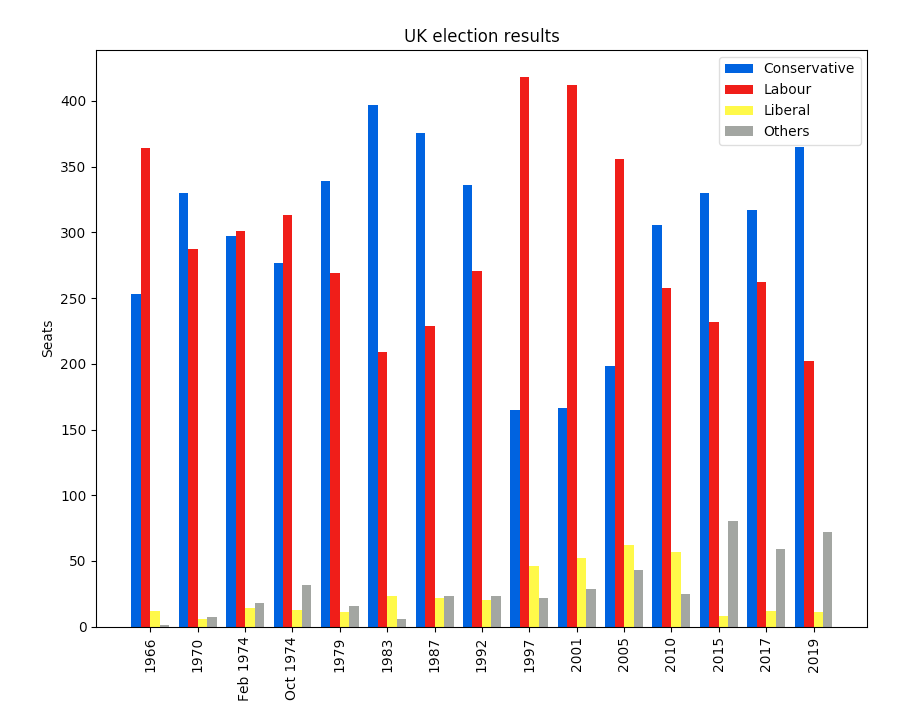

# Project Intro

Lorem ipsum dolor sit amet, consectetur adipiscing elit, sed do eiusmod tempor incididunt ut labore et dolore magna aliqua. Ut enim ad minim veniam, quis nostrud exercitation ullamco laboris nisi ut aliquip ex ea commodo consequat. Duis aute irure dolor in reprehenderit in voluptate velit esse cillum dolore eu fugiat nulla pariatur. Excepteur sint occaecat cupidatat non proident, sunt in culpa qui officia deserunt mollit anim id est laborum.

# Project structure
```
project 
|__ .gitignore          # gitignore file
|__ envname.yml         # conda environment
| 
|__ data/               # contains raw and cleaned data
|   |__ raw.csv         # raw data
|   |__ cleaned.csv     # cleaned data
|
|__ notebooks/
|   |__ cleaning.ipynb  # cleaning notebook that takes in the raw data and outputs cleaned data for analysis
|   |__ analysis.ipynb  # analysis notebook that contains charts 
|
|__ images/             # contains snippets from jupyter notebook
|
|__ proposal/
|   |__ proposal.md     # project proposal 

```

# Usage

Create an environment from YAML file and activate environment 
```
# create environment 
conda env create --file envname.yml

# activate environment
conda activate envname
```

Export an environment to a YAML file that can be read on Windows, macOS, and Linux
```
conda env export --name envname > envname.yml
```

# Questions 

1. Lorem ipsum dolor sit amet, consectetur adipiscing elit? 
2. sed do eiusmod tempor incididunt ut labore et dolore magna aliqua? 
3. Ut enim ad minim veniam, quis nostrud exercitation? 


# Datasets 

|No|Source|Link|
|-|-|-|
|1|Australian Government Open Source Datasets|https://data.gov.au/|
|2|Kaggle Open Source Datasets|https://www.kaggle.com/datasets|


# Analysis

### Question 1: Lorem ipsum dolor sit amet, consectetur adipiscing elit? 



Lorem ipsum dolor sit amet, consectetur adipiscing elit, sed do eiusmod tempor incididunt ut labore et dolore magna aliqua. Ut enim ad minim veniam, quis nostrud exercitation ullamco laboris nisi ut aliquip ex ea commodo consequat. Duis aute irure dolor in reprehenderit in voluptate velit esse cillum dolore eu fugiat nulla pariatur. Excepteur sint occaecat cupidatat non proident, sunt in culpa qui officia deserunt mollit anim id est laborum.

### Question 2: sed do eiusmod tempor incididunt ut labore et dolore magna aliqua? 


Lorem ipsum dolor sit amet, consectetur adipiscing elit, sed do eiusmod tempor incididunt ut labore et dolore magna aliqua. Ut enim ad minim veniam, quis nostrud exercitation ullamco laboris nisi ut aliquip ex ea commodo consequat. Duis aute irure dolor in reprehenderit in voluptate velit esse cillum dolore eu fugiat nulla pariatur. Excepteur sint occaecat cupidatat non proident, sunt in culpa qui officia deserunt mollit anim id est laborum.

### Question 3: Ut enim ad minim veniam, quis nostrud exercitation? 


Lorem ipsum dolor sit amet, consectetur adipiscing elit, sed do eiusmod tempor incididunt ut labore et dolore magna aliqua. Ut enim ad minim veniam, quis nostrud exercitation ullamco laboris nisi ut aliquip ex ea commodo consequat. Duis aute irure dolor in reprehenderit in voluptate velit esse cillum dolore eu fugiat nulla pariatur. Excepteur sint occaecat cupidatat non proident, sunt in culpa qui officia deserunt mollit anim id est laborum.

# Contributors
- [@jonathanneo](https://github.com/jonathanneo)
- [@yourTeamMate1](https://github.com)
- [@yourTeamMate2](https://github.com)